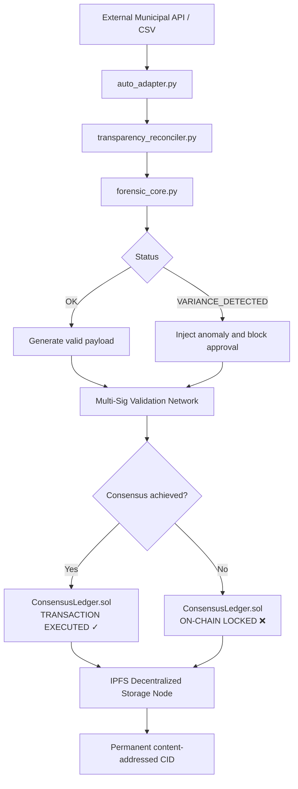

# 🧬 OFFF Architecture Specification: Phase 2 (Roadmap 2026+)
## Decentralized Multi-Signature Consensus & Censorship-Resistant IPFS Storage

This document specifies the architectural design and integration protocols for the next evolutionary phase of the Open Fiscal Forensics Framework (OFFF). The goal is to transition the framework from a single-node MVP into a decentralised, zero-trust public audit network.

---

## 1. System Architecture Overview



---

## 2. Component Specifications

### Module A: Multi-Signature Consensus (`ConsensusLedger.sol`)

To eliminate any single point of failure (SPoF) or administrative override, transactions must be approved by a decentralised pool of independent validators. These may include civic auditors, public oversight entities, municipal councillors, or independent citizen-operated validators.

Core rules:

- each validator must be explicitly registered
- each transaction has a separate approval state
- approval count must reach a defined quorum threshold
- a malformed or empty tender identifier must block execution

A critical rule is:

```solidity
require(bytes(transactions[_txIndex].tenderId).length > 0, "ANOMALIE: Freigabe on-chain blockiert.");
```

This is essential because an empty or malformed `tenderId` is a valid forensic red flag and should prevent execution before approval is possible.

### Smart contract pattern

```solidity
// SPDX-License-Identifier: MIT
pragma solidity ^0.8.20;

contract MultiSigConsensusLedger {
    struct Transaction {
        address recipient;
        uint256 amount;
        string tenderId;
        bool executed;
        uint256 approvalCount;
    }

    address[] public validators;
    mapping(address => bool) public isValidator;
    mapping(uint256 => mapping(address => bool)) public hasApproved;

    Transaction[] public transactions;
    uint256 public requiredApprovals;

    modifier onlyValidator() {
        require(isValidator[msg.sender], "Nicht autorisierter Validator.");
        _;
    }

    constructor(address[] memory _validators, uint256 _requiredApprovals) {
        validators = _validators;
        requiredApprovals = _requiredApprovals;
        for (uint256 i = 0; i < _validators.length; i++) {
            isValidator[_validators[i]] = true;
        }
    }

    function proposeTransaction(
        address _recipient,
        uint256 _amount,
        string memory _tenderId
    ) external onlyValidator {
        transactions.push(Transaction({
            recipient: _recipient,
            amount: _amount,
            tenderId: _tenderId,
            executed: false,
            approvalCount: 0
        }));
    }

    function approveTransaction(uint256 _txIndex) external onlyValidator {
        require(!transactions[_txIndex].executed, "Transaktion bereits ausgefuehrt.");
        require(!hasApproved[_txIndex][msg.sender], "Bereits genehmigt.");
        require(bytes(transactions[_txIndex].tenderId).length > 0, "ANOMALIE: Freigabe on-chain blockiert.");

        hasApproved[_txIndex][msg.sender] = true;
        transactions[_txIndex].approvalCount++;

        if (transactions[_txIndex].approvalCount >= requiredApprovals) {
            executeTransaction(_txIndex);
        }
    }

    function executeTransaction(uint256 _txIndex) internal {
        Transaction storage txToExecute = transactions[_txIndex];
        txToExecute.executed = true;
        // actual asset transfer logic goes here
    }
}
```

### Why this matters

This changes the governance model from:

- one authority signs

into:

- multiple independent parties must agree

That materially reduces:

- insider manipulation
- selective censorship
- single-actor override
- opaque approval chains

### Python integration

The Python layer should act as a validator node. Each OFFF instance can run independently and refuse issuer approval if it detects suspicious ledger deltas or malformed procurement metadata.

The reconciliation process becomes a consensus gate, not just an automated output generator.

---

### Module B: Permanent IPFS Ingestion (Censorship Resistance)

To prevent the city administration or malicious actors from deleting evidence, PDFs, manifests, and CSV datasets are stored in IPFS as permanent, content-addressed files.

```text
[ OFFF Core ] ──► Generates report (PDF) ──► encryption/signing ──► IPFS node
                                                                  │
                                                                  ▼
                                                        Immutable CID hash
                                                (persistent public audit evidence)
```

### IPFS integration pattern

```python
import ipfshttpclient
from pathlib import Path


def upload_forensic_evidence_to_ipfs(file_path: Path) -> str:
    """
    Upload a forensic PDF certificate directly to the IPFS network.
    Return the immutable content hash (CID).
    """
    try:
        client = ipfshttpclient.connect('/ip4/127.0.0.1/tcp/5001/http')
        res = client.add(str(file_path))
        ipfs_cid = res['Hash']

        print("[IPFS REGISTRY] Dokument dauerhaft verankert!")
        print(f"[IPFS CID-HASH] https://ipfs.io/ipfs/{ipfs_cid}")
        return ipfs_cid

    except Exception as exc:
        print(f"[IPFS ERROR] Verbindung zum Daemon fehlgeschlagen: {exc}")
        return ""
```

### Why this is manipulation-resistant

- content addressing via CID: evidence is retrieved by the content hash, not by a URL path
- any change to one byte changes the CID
- if a procurement report is altered, the hash mismatch becomes immediately visible
- IPFS pinning across independent civic nodes reduces the likelihood of coordinated deletion or takeover

This creates a durable evidentiary layer for public auditing, civil oversight, and legal reproducibility.

---

## 3. Contribution Guidelines for Open-Source Developers

We welcome contributions that improve the integrity layer, cryptographic bridge, and public evidence flow.

1. Fork the repository and target the `main` branch.
2. Keep the core logic stateless and deterministic whenever possible.
3. Validate transaction boundaries using local mock RPC logic before upstream submission.
4. Restrict core dependencies to web3.py, pandas, requests, and standard library modules where feasible.
5. Treat every audit artifact as a public evidence object and keep provenance metadata explicit.

---

## 4. Strategic Governance Message for Public Institutions

> The future of public fiscal transparency is not a single database controlled by one institution. It is a public audit network combining forensic analysis, decentralised validation, and immutable evidence storage. No single authority can silently manipulate the record without leaving a cryptographic trail.

This is the right technical foundation for democratic transparency, cross-institutional oversight, and long-term civic trust.

---

## 5. Recommended Phase 2 Rollout Sequence

1. Extend the contract to multi-validator approval logic.
2. Add validator quorum enforcement in the reconciler layer.
3. Add IPFS upload for generated PDF and JSON evidence.
4. Store the CID hash in public audit metadata.
5. Add provenance verification endpoints for citizens and auditors.
6. Publish the public evidence trail alongside the chain records.

---

## 6. Final Positioning Statement

> OFFF is being evolved into a resilient public verification architecture. It combines forensic financial analysis, cryptographic consensus, and content-addressed proof storage to make procurement accountability harder to manipulate, easier to verify, and more durable over time.

---

## 7. Short institutional summary

> If the question is what the future of transparent governance looks like, the answer is simple: one citizen cannot rewrite the budget story, one administrator cannot erase the evidence, and one compromised server cannot silently alter the public record. The audit is no longer a document; it becomes a verifiable public process.
